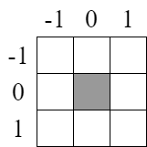
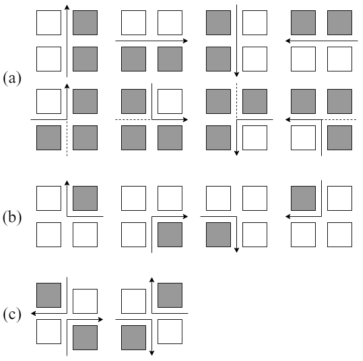
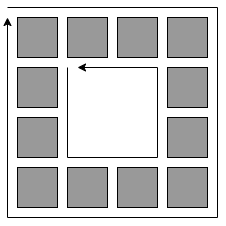

# 图像输入和预处理
## 图像二值化
二值化后的图像应该是单通道1bit图像，1代表主体，0代表背景。
## padding
边缘采用一个单位像素的zero padding。
# 边缘检测
对padding后的二值化图像中主体部分（即标记为1的部分）进行边缘检测。

如图所示，(0,0)为目标像素，将卷积核内的所有二值化像元做与运算，结果为真代表不是边缘，否则代表是边缘。
# 边缘追踪
对检测到的边缘进行追踪，具体算法流程如下：
## Algorithm TraceEdges
输入：边缘检测结果EdgePixels，原始二值化像素OriginPixels
输出：有向环集合Edges
$\begin{array}{l} 1: & OpenSet \leftarrow EdgePixels \end{array}$
$\begin{array}{l} 2: & \begin{array}{l} FORALL & pixel & in & OpenSet: \end{array} \end{array}$
$\begin{array}{l} 3: & \begin{array}{l} & Edges \leftarrow Edges \cup \{ TraceEdge(pixel, OriginPixels, OpenSet) \} \end{array} \end{array}$
$\begin{array}{l} 4: & \begin{array}{l} END & FORALL \end{array} \end{array}$
$\begin{array}{l} 5: & RETURN \end{array}$
## Algorithm TraceEdge
输入：起始像素pixel, 原始像素OriginPixels, 开集合OpenSet
输入：有向环edge
$\begin{array}{l} 1: & edge \leftarrow \{ 起始点坐标 \} \end{array}$
$\begin{array}{l} 2: & FOR \end{array}$
$\begin{array}{l} 3: & \begin{array}{l} & next \leftarrow Next(edge[-1]) \end{array} \end{array}$
$\begin{array}{l} 4: & \begin{array}{l} & IF & next == start \end{array} \end{array}$
$\begin{array}{l} 5: & \begin{array}{l} & & RETRUN & edge \end{array} \end{array}$
$\begin{array}{l} 6: & \begin{array}{l} & ENDIF \end{array} \end{array}$
$\begin{array}{l} 7: & \begin{array}{l} & edge \leftarrow edge \cup \{ next \} \end{array} \end{array}$
$\begin{array}{l} 8: & \begin{array}{l} & OpenSet - \{ Next经过的像素 \} \end{array} \end{array}$
$\begin{array}{l} 9: & \begin{array}{l} END & FOR \end{array} \end{array}$
## Next

如图所示，边缘追踪路径前方的右侧总是主体像素，而路径前方的左侧则总是背景像素，基于此类规则进行边缘追踪。在（a）组的情况当中当中，除了路径前方右侧的像素要从开集合中移出外，还要将路径后方右侧的像素也从开集合中移出，避免因为（a）组中下方所示情况导致转角像素没能从开集合中移除的情况。（b）组中只需判断前方像素即可。对于（c）组中的情况，我们认为这样的像素的不连接的，根据历史路径来推测前方路径走向。请自行阅读源码，不再用伪代码赘述。
# 判断外环内环

如图所示，根据[上节](##边缘追踪)中描述的方法，外环总是顺时针走向，而内环总是逆时针走向，只需对有向环的走向进行判断即可判别是内环还是外环，使用鞋带定理（Shoelace formula）实现，不做赘述。
# 环抽稀
对环上的点进行抽稀，只保留关键点，使用道格拉斯-普克（Douglas-Peuker）算法实现，不做赘述
# 复杂包含关系
存在着内环中包含另一个外环的情况，譬如西方近代的棱堡：彼得保罗要塞就存在多层城墙，在遥感影像当中每层城墙都存在的外环和内环，而外层城墙的外环和内层城墙的外环都对内层城墙的外环形成包含关系。因此需要对所有包含了一个内环的外环之间判断它们的包含关系，在这中间没有包含任何一个其他外环的那个外环才是内环所对应的外环。
# 带内环空洞的多边形如何在进行几何处理
对于矢量化过后形成的MultiPolygon，可以使用耳切法进行简单的三角化，从而进一步应用三角面渲染、碰撞检测等处理。
